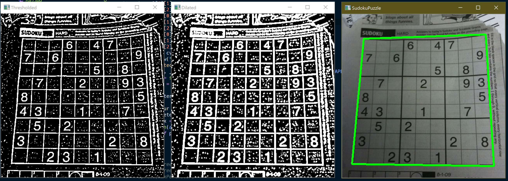

# sudoku-solve
By Hunter McGee

Python script to solve a 9x9 sodoku puzzle, using backtracking. For automatic board detection, load your image into the img directory and edit the file path inside of ex.ipynb or ex.py. For manual entry, edit myBoard inside of solver.py to fit your puzzle and simply run solver.py. 

## Current Successes:
* <b>solver.py</b> Implemented the solving algorithm
* <b>ex.py</b> Currently preprocesses image, extracts puzzle, segments puzzle to extract cells, and then feeds cells thru digit classifier model

## Necessary Packages:
* <b>OpenCV</b> 'pip install opencv-python'
* <b>Keras/TF</b> 'pip install keras'
* <b>Numpy</b> 'pip install numpy'

## Future Plans:
Improve digit classifier model

